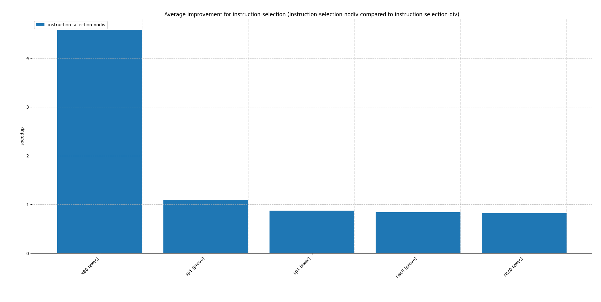
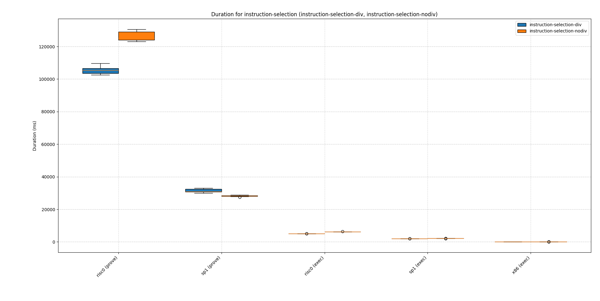

# Instruction selection

While not an LLVM pass, instruction selection can also impact zkVM performance significantly.

Consider e.g. the following function:

```rust
pub fn div_by_10(x: u32) -> u32 {
    x / 10
}
```

On `o3` for both zkVMs this produces:

```asm
lui a1, 838861
addi a1, a1, -819
mulhu a0, a0, a1
srli a0, a0, 3
```

And on x86 respectively:

```asm
mov ecx, edi
mov eax, 3435973837
imul rax, rcx
shr rax, 35
```

LLVM's backend replaces the division by a multiply and shift. The respective optimizations is implemented in LLVM's [TargetLowering](https://llvm.org/doxygen/TargetLowering_8cpp_source.html) (`BuildExactUDIV`, `BuildExactSDIV`, see also [here](https://llvm.org/devmtg/2024-10/slides/tutorial/MacLean-Fargnoli-ABeginnersGuide-to-SelectionDAG.pdf)), which means it even occurs in `o0`. As this [cannot be turned off](https://web.archive.org/web/20241001072038/https://stackoverflow.com/questions/54300860/how-to-turn-off-the-constant-folding-optimization-in-llvm) easily via a flag, we compare it to the `div`-only version using inline assembly.

For the zkVMs (rv32im) we use:

```rust
pub fn div_by_10(mut x: u32) -> u32 {
    unsafe {
        core::arch::asm!(
            "li  t0, 10",
            "div a0, a0, t0",
            inout("a0") x,
            options(nomem, nostack, pure)
        );
    }
    x
}
```

And for x86:

```rust
pub fn div_by_10(mut x: u32) -> u32 {
    unsafe {
        core::arch::asm!(
            "xor edx, edx", // zero-extend divisor
            "div ecx",
            inlateout("eax") x, 
            in("ecx")  10u32,
            lateout("edx") _, // we clobber edx
            options(nomem, pure, nostack),
        );
    }
    x
}
```

On risc0 it's easy to see that we get a reduction in cycle count. A `div` and an `li` use a combined 3 cycles, whereas the other variant with `lui`, `addi`, `mulhu` and `srli` takes a combined 5 cycles.


Looking at the speedup we get by not having a `div` instruction, this effect makes itself more clear:





Replacing a `div` by multiply and shift degrades performance on risc0 and also does so for execution on sp1.

While having a `div` is generally cheaper on zkVMs, it still yields a slight degradation on sp1 proving (despite the cycle count being reduced). This also illustrates that cycle count is not always directly related to proving time. Even though the `div` instruction reduces the number of executed cycles, it introduces more constraints for the prover (e.g. for remainder). In contrast, the multiply-and-shift variant, while longer in terms of cycles, uses only low-degree constraints (basic multiplication and bit-shifts), which may be cheaper for the prover to handle algebraically. This also shows that during instruction selection we cannot just always optimize for fewer cycles but also need to take into account the constraint complexity in the prover.

## Conclusions

Divisions are expensive on most architectures, on zkVMs however the difference is much smaller (on risc0 e.g. a `div` is only 2 cycles compared to 1 cycle for an `add`). The LLVM backend should therefore refrain from replacing `div`'s with equivalent alternatives in most cases. Similar to instruction combining/selection we should update the LLVM cost model to reflect these circumstances. Additionally, the LLVM `TargetLowering` class also provides a method `isIntDivCheap` which could be adjusted on the respective backend.
