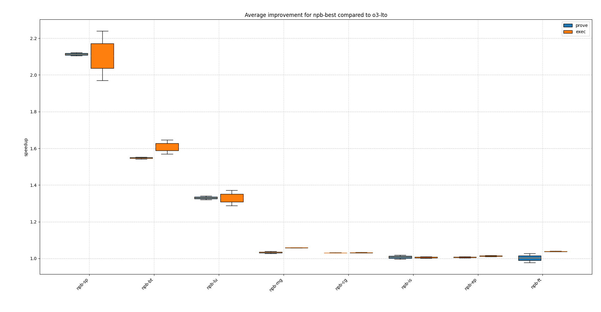
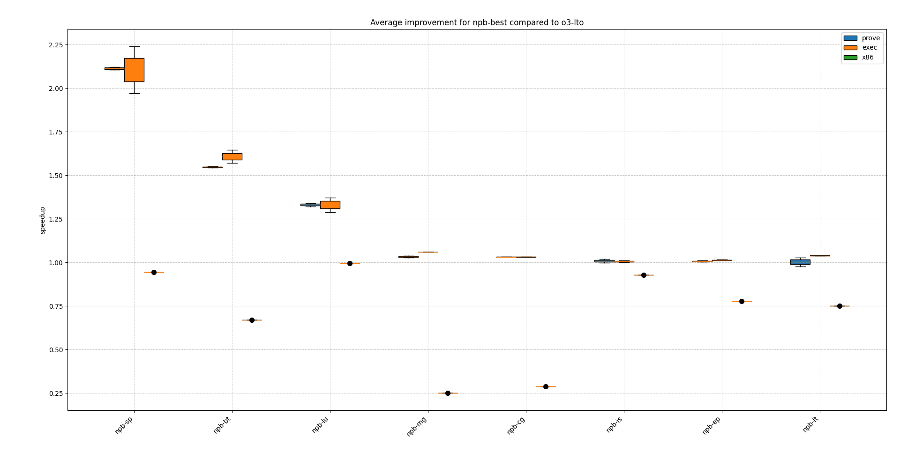

# npb genetic run

For the `npb` benchmark suite, applying the following passes:

```text
function(lower-invoke,simplifycfg),module(rel-lookup-table-converter),function(dse,reassociate,speculative-execution,separate-const-offset-from-gep),module(always-inline),function(irce),module(inline),function(gvn),module(function-attrs,attributor),function(loop-sink,loop-mssa(licm),dse,newgvn,loop(loop-reduce),reg2mem)
```

Along with the following flags:

```text
-C opt-level=3 -C lto=fat -C embed-bitcode -C codegen-units=1 -Cllvm-args=-inline-threshold=4328 -Cllvm-args=-jump-threading-implication-search-threshold=8 -Cllvm-args=-licm-versioning-max-depth-threshold=1 -Cllvm-args=-max-nested-scalar-reduction-interleave=2 -Cllvm-args=-max-speculation-depth=1 -Cllvm-args=-max-uses-for-sinking=47 -Cllvm-args=-memdep-block-number-limit=1121 -Cllvm-args=-memdep-block-scan-limit=276
```

results in the following speedup:



Interestingly, when applying the same optimization sequence on standard x86 execution, we get a degradation in performance:



We analyze `npb-bt` as it exhibits both behaviors strongly: it exhibits a strong speedup for both zkVMs and a strong degradation on x86.

TODO: Root cause analysis for improvement in npb benchmarks
